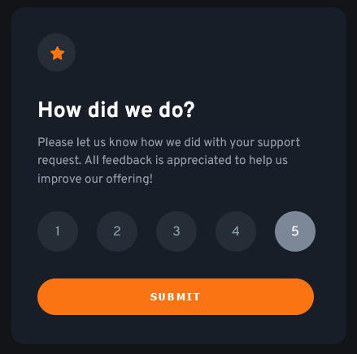
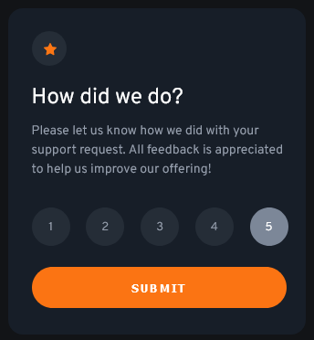

# Frontend Mentor - Interactive rating component solution

This is a solution to the [Interactive rating component challenge on Frontend Mentor](https://www.frontendmentor.io/challenges/interactive-rating-component-koxpeBUmI). Frontend Mentor challenges help you improve your coding skills by building realistic projects. 

## Table of contents

- [Overview](#overview)
  - [The challenge](#the-challenge)
  - [Screenshot](#screenshot)
  - [Links](#links)
- [My process](#my-process)
  - [Built with](#built-with)
  - [What I learned](#what-i-learned)
  - [Continued development](#continued-development)
  - [Useful resources](#useful-resources)
- [Author](#author)

## Overview

### The challenge

Users should be able to:

- View the optimal layout for the app depending on their device's screen size
- See hover states for all interactive elements on the page
- Select and submit a number rating
- See the "Thank you" card state after submitting a rating

### Screenshot

### Links

- Solution URL: [https://github.com/erokingIt/InteractiveRatingComponent](https://github.com/erokingIt/InteractiveRatingComponent)
- Live Site URL: [https://erokingit.github.io/InteractiveRatingComponent/](https://erokingit.github.io/InteractiveRatingComponent/)

## My process

### Built with

- Semantic HTML5 markup
- CSS custom properties
- Flexbox
- SASS CSS Pre-processor
- Used paint.net to determine component colors, dimensions, and padding/margins

### What I learned

- Learned how to use SASS to style a web page and in Visual Studio Code IDE
- How to write in SASS language, use variables, use mixins, and partials
- Adjusting the viewBox property of a SVG html tag

### Continued development

This was my first experience with SASS and I'd like to work with it more. I would like to explore more SASS features and how it can steamline my development. I want understand how to adjust SVG's in the simplest sense.

### Useful resources

- [SASS](https://sass-lang.com/) - Helped introduce me to SASS and it's features.
- [W3Schools](https://www.w3schools.com/) - Helped me with flexbox and SVG properties.

## Author

- Website - (https://github.com/erokingIt)
- Frontend Mentor - (https://www.frontendmentor.io/profile/erokingIt)
